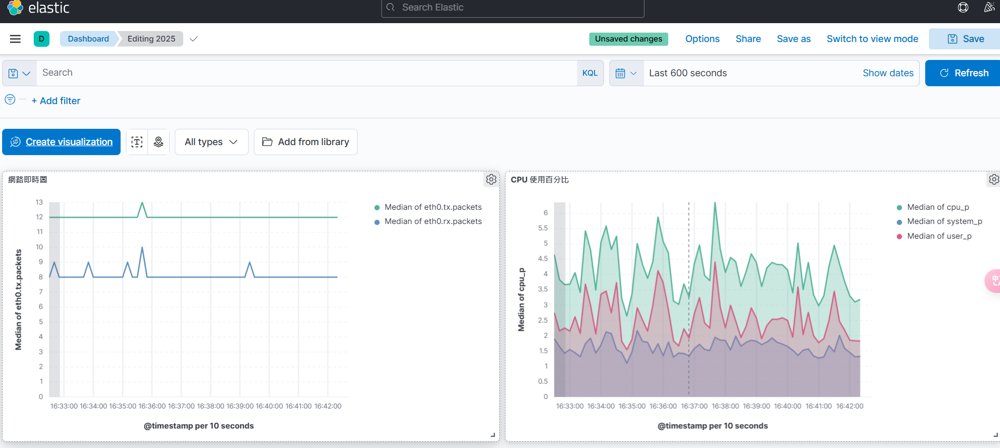
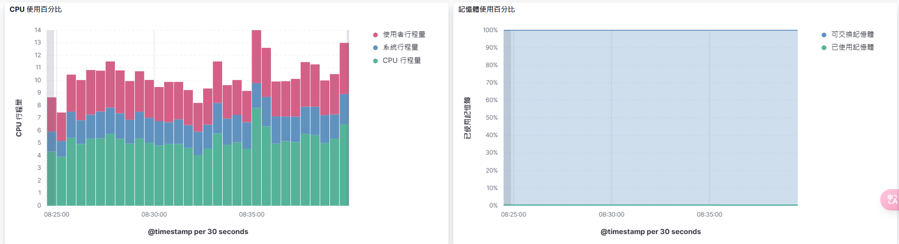
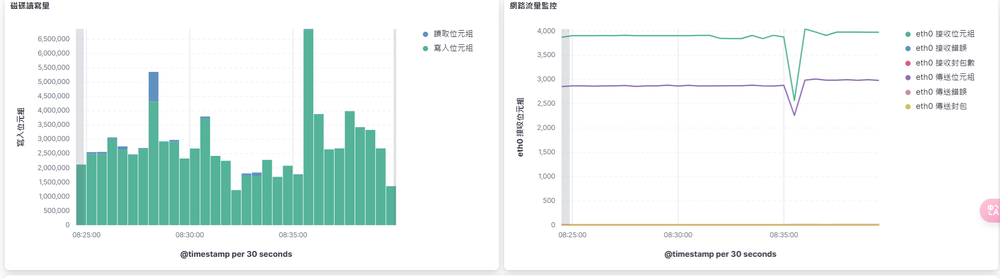
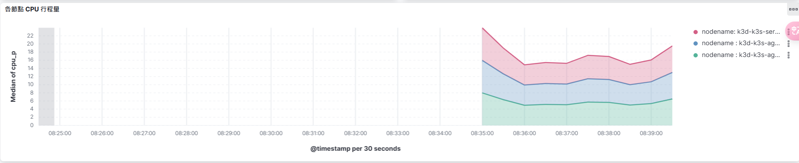
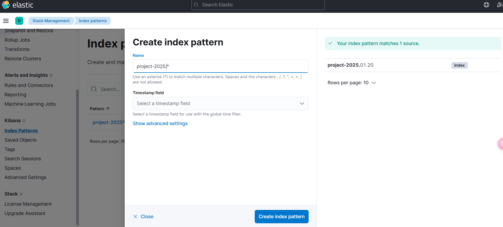
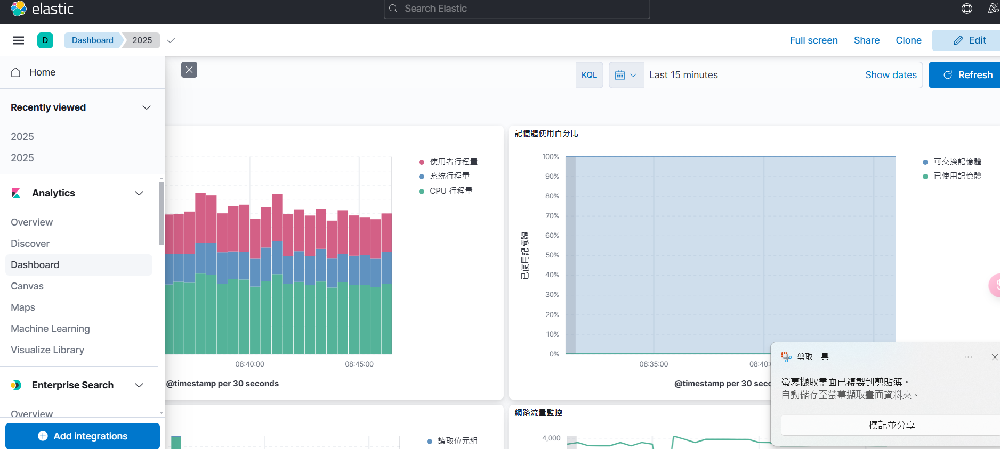

# Google Developer Groups on Campus NTUST ElasticStack 課程

> Author FKT

---

## In this course you will learned

1. K3d
2. Elasticstack
3. high availability
4. Elasticsearch DSL
5. Related DevOps Issues
6. A liite be Kubernetes

---

## Preview

本次課程完成樣貌，一個自動監控多節點的資源儀表板






---

## Getting Started

### 1. 安裝 k3d kubectl

```shell=
curl https://raw.githubusercontent.com/fan9704/KubernetsInstallScript/refs/heads/master/install_k3d.sh | bash
```

### 2. 配置 kubectl context

```shell
export KUBECONFIG="$(k3d kubeconfig write k3s-default)"
```

若要長期使用，可以配置到 *.bashrc* or *.zshrc* 末端

### 3. Setup EFK


```shell
cd efk
kubetl apply -f .
```

### 4. PortForwards EFK

先找到你的 Kibana Pod
```shell
kubectl get pod
```


```shell
kubectl port-forward elasticsearch-kibana-XXXX 5601:5601
```

### 5. Setup Index Pattern

進入 Kibana > Stack Management > Index Pattern



### 6. Create Dashboard

進入 Kibana > Dashboard > Create Dashboard



### 7. Scale up Cluster

新增成三節點分散式 Cluster

```shell
# 新增節點 1
k3d node create node-1 -c k3s-default --role agent
# 新增節點 2
k3d node create node-2 -c k3s-default --role agent
```
